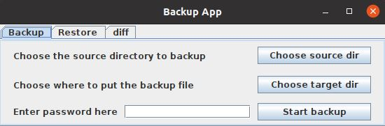

# Backup App



## 功能

整体功能为备份指定文件夹并还原。

备份过程分为以下几步：

1. 打包（`sourceDir -> sourceDir.pack` ）：将指定文件夹下的文件（普通文件、目录和软链接）打包，可以通过创建 `.bakignore` 文件指定需要过滤的文件。打包目录中如果多个硬链接指向同一份数据，那么该数据只会打包一次，并且还原时也只还原一份，并建立多个指向它的硬链接。
2. 压缩（`sourceDir.pack -> sourceDir.pack.huff`）：使用 Huffman 压缩算法进行压缩。
3. 加密（`sourceDir.pack.huff -> sourceDir.pack.huff.enc` ）：使用一个简单的带混淆机制的加密算法进行加密。
4. diff：比较两个目录的文件差异

还原过程就是上面过程反过来。

## 编译运行

本项目使用 Maven 构建。

如果需要使用本项目进行实际的备份还原，需要以下环境：

- JDK：**JDK 13**（实测发现 JDK 8、JDK 11 在修改软连接的属性时会出现 bug）。

- OS：Linux（开发测试使用的时 Ubuntu 20.04）。

如果仅仅是需要编译本项目并运行显示 GUI，Windows + JDK 13 也行。

编译：

```shell
mvn compile
```

运行:

```shell
# Linux 下
mvn exec:java -Dexec.mainClass=backup.GUIApp

# Windows 下
mvn exec:java "-Dexec.mainClass=backup.GUIApp"
```

